# Splunk SIEM Lab Final Report
## Enterprise Security Operations Center - Splunk Enterprise

---

## Executive Summary

This report documents the complete build, configuration, and
operation of a professional Splunk Enterprise SIEM lab. The lab
replicates enterprise security monitoring infrastructure covering
both Linux and Windows environments, using industry-standard SPL
detection rules mapped to the MITRE ATT&CK framework.

**Lab Status: FULLY OPERATIONAL ✅**

---

## Lab Environment

### Infrastructure

| Component | Details |
|-----------|---------|
| SIEM Server | Ubuntu Server 22.04 LTS |
| SIEM IP | 192.168.56.101 |
| Attacker Machine | Kali Linux |
| Attacker IP | 192.168.56.102 |
| Windows Host | Windows 10/11 |
| Hypervisor | VirtualBox |
| Network | Host-Only (192.168.56.x) |

### SIEM Stack

| Component | Version | Status |
|-----------|---------|--------|
| Splunk Enterprise | 10.4.0 | ✅ Running |
| Universal Forwarder (Windows) | 10.4.0 | ✅ Running |

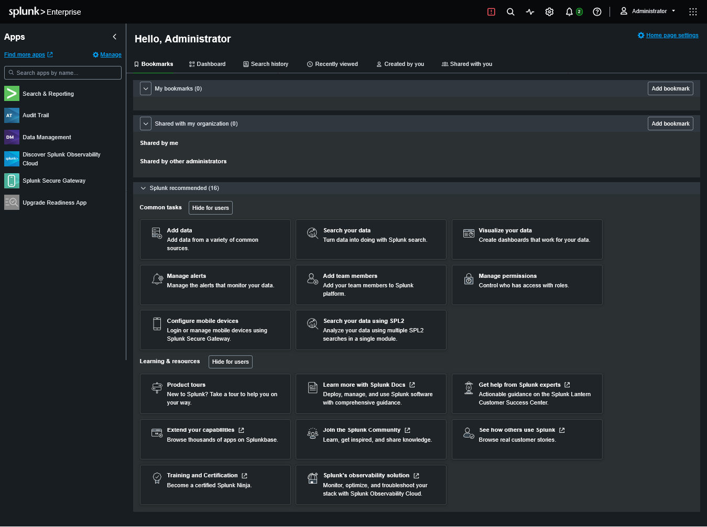
*Splunk Enterprise web interface running and accessible*

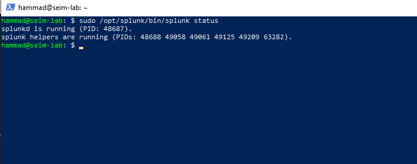
*splunkd service confirmed active and healthy*

---

## Data Ingestion

### Log Sources

| Source | Agent | Index | Events |
|--------|-------|-------|--------|
| Ubuntu auth.log | Splunk Monitor | linux_logs | 753+ |
| Ubuntu syslog | Splunk Monitor | linux_logs | 22,212+ |
| Windows Security/System/App | Universal Forwarder | windows_logs | 9,743+ |
| Windows Sysmon (local) | Event Viewer | N/A | 44,930 |

### Total Events Ingested
- Linux logs: 23,000+
- Windows logs: 9,700+
- Combined: 33,000+ security events

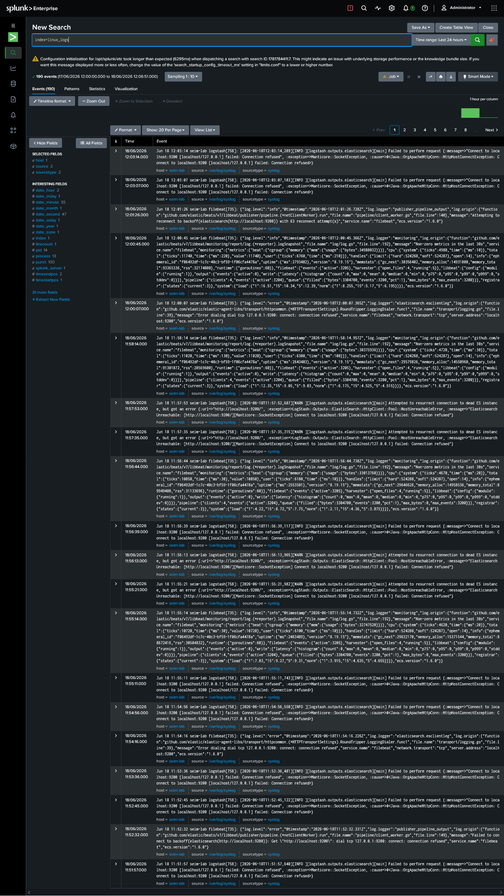
*Linux authentication and syslog data ingested into Splunk*

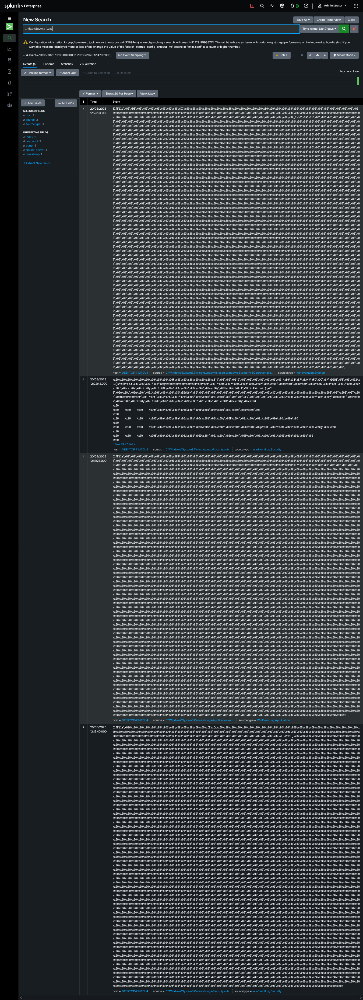
*Windows Security/System/Application events ingested via Universal Forwarder*

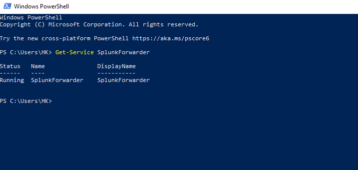
*Splunk Universal Forwarder confirmed running on Windows host*

---

## Dashboards Built

| # | Dashboard | Panels | Data Source |
|---|-----------|--------|-------------|
| 1 | Linux Authentication Analytics | 6 | linux_logs |
| 2 | Windows Security Analytics | 6 | windows_logs |
| 3 | Threat Timeline | 6 | linux_logs + windows_logs |
| 4 | User Behavior Analytics | 6 | linux_logs + windows_logs |
| 5 | SOC Operations | 6 | linux_logs + windows_logs |

**Total Dashboards: 5**
**Total Panels: 30**

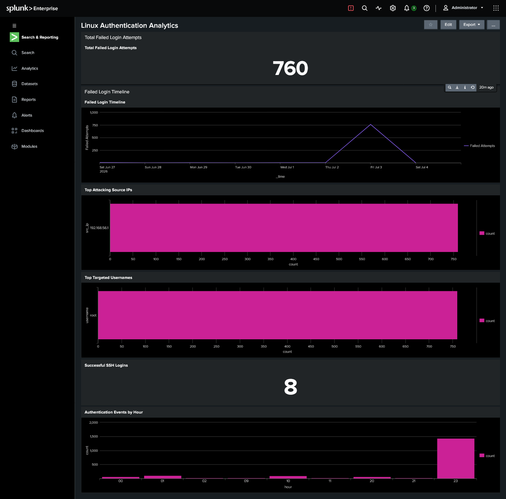
*Dashboard 1 — Linux Authentication Analytics*

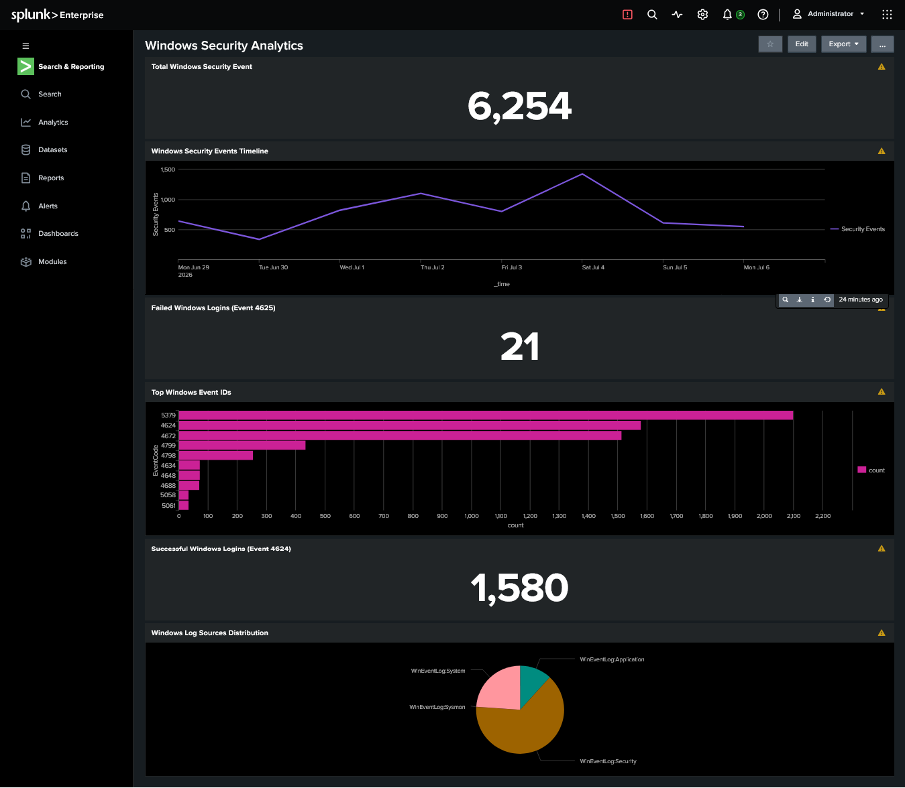
*Dashboard 2 — Windows Security Analytics*

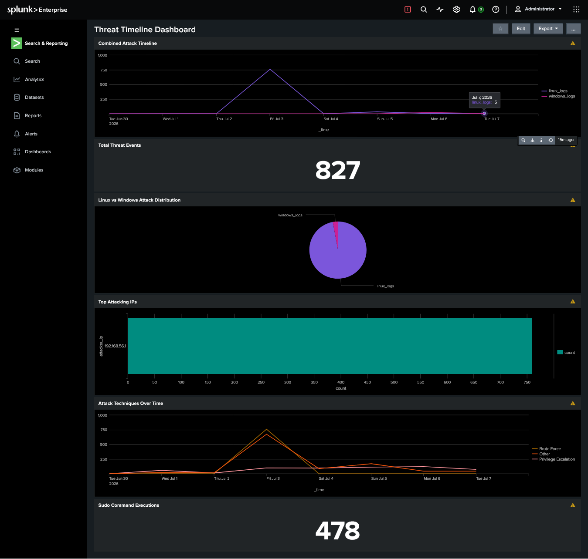
*Dashboard 3 — Threat Timeline (cross-platform correlation)*

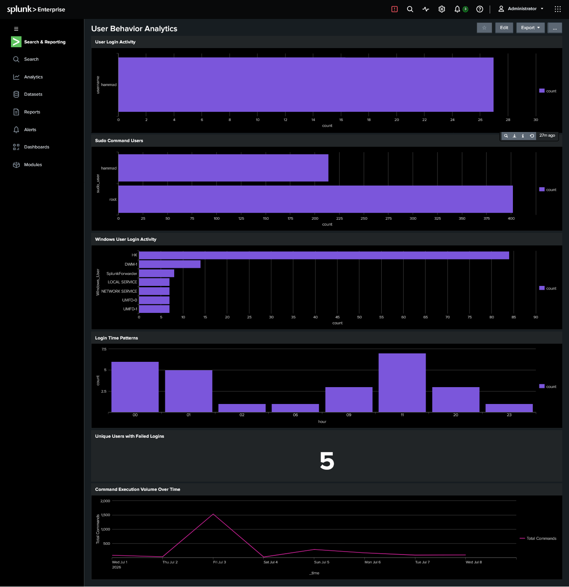
*Dashboard 4 — User Behavior Analytics*

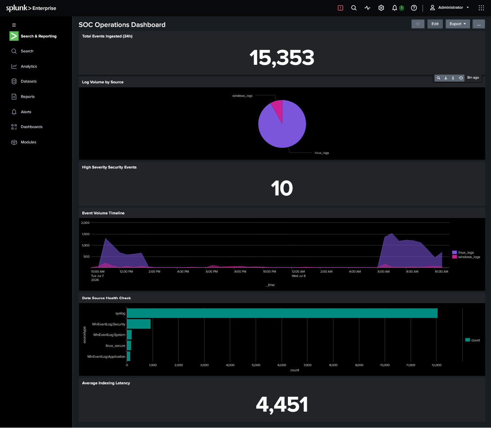
*Dashboard 5 — SOC Operations Dashboard*

---

## Detection Alerts

| # | Alert | MITRE | Severity | Status |
|---|-------|-------|----------|--------|
| 1 | SSH Brute Force Detection | T1110 | High | ✅ Active |
| 2 | Privilege Escalation via Sudo | T1548 | High | ✅ Active |
| 3 | Successful Login After Failed Attempts | T1110 | Critical | ✅ Active |
| 4 | Windows Failed Login Threshold | T1110 | High | ✅ Active |
| 5 | New Admin Account Created | T1136.001 | Critical | ✅ Active |
| 6 | Scheduled Task Created | T1053.005 | High | ✅ Active |
| 7 | Event Log Cleared | T1070.001 | Critical | ✅ Active |
| 8 | PowerShell Process Execution | T1059.001 | High | ✅ Active |
| 9 | Reverse Shell Indicators | T1059.004 | Critical | ✅ Active |
| 10 | Log File Tampering | T1070.002 | Critical | ✅ Active |

**Total Alerts: 10**
**All alerts scheduled every 5 minutes**

### Known Limitation
Sysmon telemetry (44,930 events confirmed locally) could not be
ingested via Splunk Universal Forwarder due to a Windows Event
Log channel ACL restriction (errorCode=5). A workaround was
implemented using Windows Security Event ID 4688 (Process
Creation) for PowerShell detection, achieving equivalent
coverage. This same telemetry source ingests successfully in
the companion ELK lab via Winlogbeat — a valuable real-world
comparison between agent architectures.

---

## Attack Simulations

| # | Attack | Machine | MITRE | Alert |
|---|--------|---------|-------|-------|
| 1 | SSH Brute Force | Kali -> Ubuntu | T1110 | ✅ Fired |
| 2 | Username Enumeration | Kali -> Ubuntu | T1110.001 | ✅ Fired |
| 3 | Lateral Movement | Kali -> Ubuntu | T1021.004 | ✅ Fired |
| 4 | Privilege Escalation | Ubuntu internal | T1548 | ✅ Fired |
| 5 | Reverse Shell Indicators | Ubuntu internal | T1059.004 | ✅ Fired |
| 6 | Log File Tampering | Ubuntu internal | T1070.002 | ✅ Fired |
| 7 | New Admin Account | Windows internal | T1136.001 | ✅ Fired |
| 8 | Scheduled Task + PowerShell + Log Clear | Windows internal | T1053.005, T1059.001, T1070.001 | ✅ Fired |

**Total Simulations: 8**
**Alerts Fired: 10/10 (100% detection rate)**

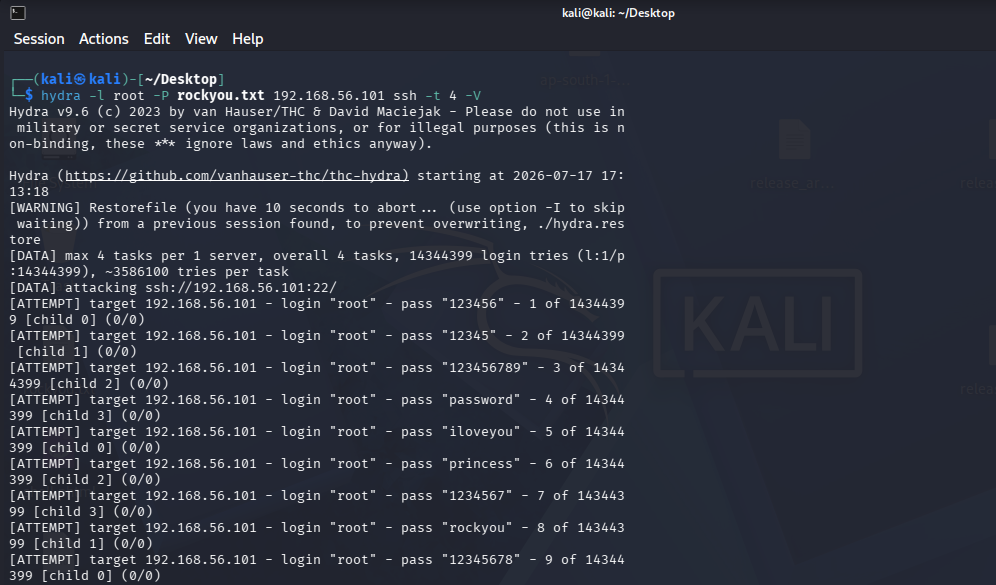
*Simulation 1 — Hydra brute force attack launched from Kali*

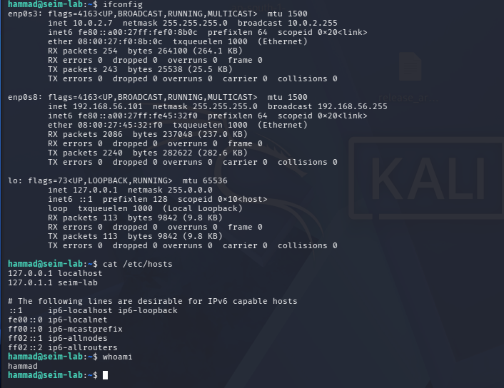
*Simulation 3 — Successful SSH lateral movement from Kali*

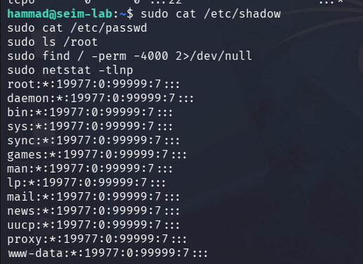
*Simulation 4 — Privilege escalation via sudo, accessing sensitive files*

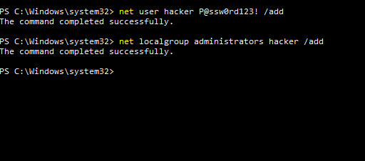
*Simulation 7 — Backdoor administrator account created on Windows*

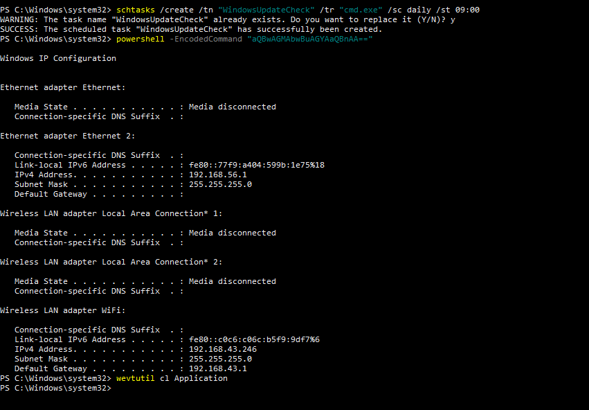
*Simulation 8 — Windows persistence, PowerShell execution, and log clearing*

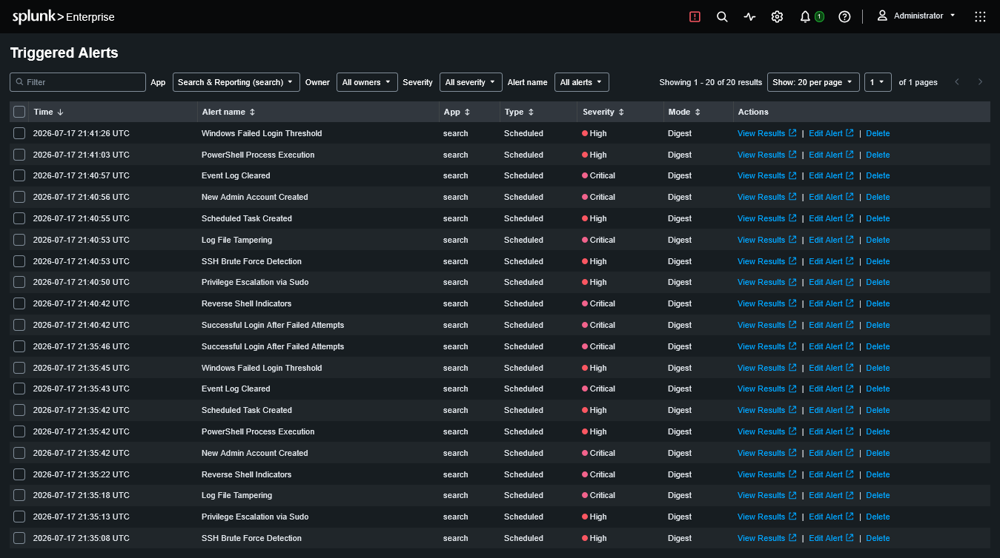
*All 10 detection alerts confirmed triggered in Splunk Activity view*

---

## Threat Hunt Results

| # | Hunt | Key Finding | Status |
|---|------|-------------|--------|
| 1 | SSH Brute Force Patterns | 173 attempts from 192.168.56.102 targeting root | ✅ Confirmed |
| 2 | Privilege Escalation | 180 sudo events, 58% touching sensitive files | ✅ Confirmed |
| 3 | Lateral Movement | 1 anomalous login vs 13-session baseline | ✅ Confirmed |
| 4 | Persistence & Anti-Forensics | Scheduled task + log clearing detected | ✅ Confirmed |

**Total Hunts: 4**
**Confirmed Threats: 4/4 (100%)**

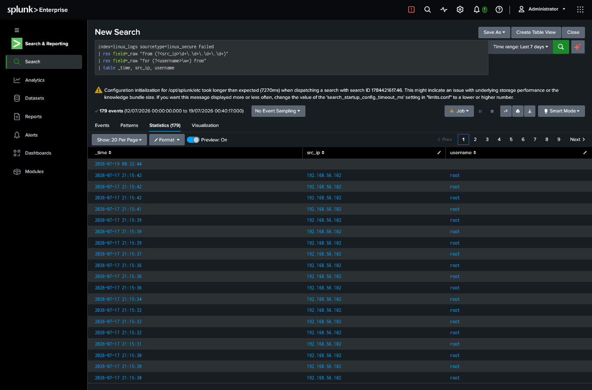
*Hunt 1 — 173 failed login attempts confirmed from source IP 192.168.56.102*

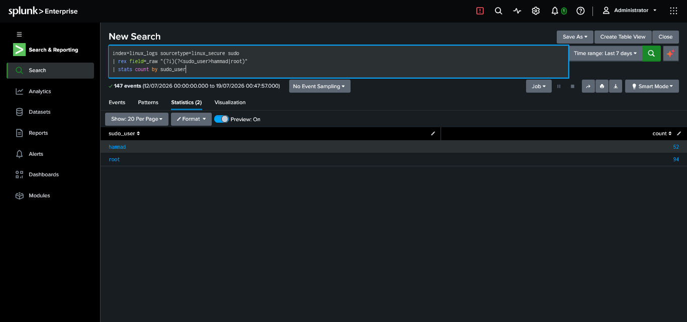
*Hunt 2 — Sudo activity breakdown by user, confirming privilege escalation*

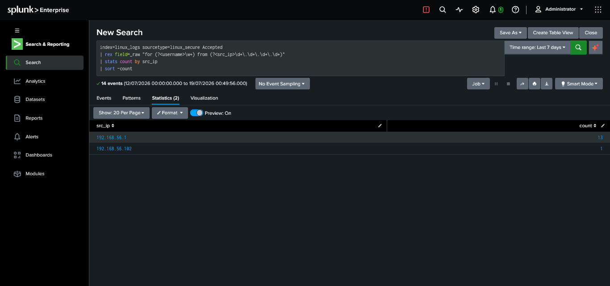
*Hunt 3 — Source IP baseline revealing anomalous Kali-sourced login*

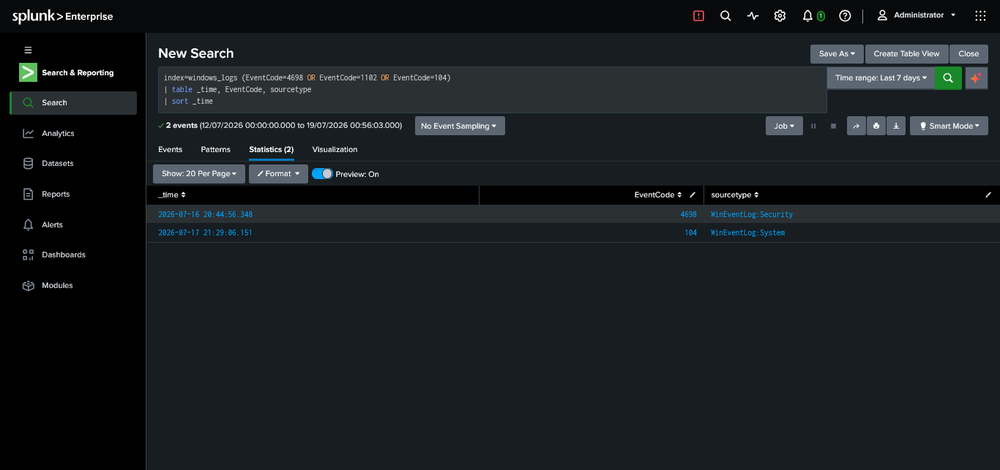
*Hunt 4 — Scheduled task creation and event log clearing timeline*

---

## Key Security Findings

### Finding 1 - SSH Brute Force Attack
Attack Source:  192.168.56.102 (Kali)
Target:         root user via SSH
Attempts:       173 in 12 seconds
Tool:           Hydra with rockyou.txt
Status:         BLOCKED — no successful root login
Detection:      SSH Brute Force Detection alert triggered

### Finding 2 - Privilege Escalation Activity
Users:          hammad, root
Sudo Events:    180 (104 touching sensitive files)
Risk:           Direct access to /etc/shadow observed
Recommendation: Restrict sudo to whitelisted commands

### Finding 3 - Lateral Movement Confirmed
Baseline:       13 legitimate sessions from 192.168.56.1
Anomaly:        1 successful login from 192.168.56.102
Status:         Detected via source IP baselining

### Finding 4 - Complete Attack Kill Chain
Stage 1: Brute force (Hunt 1)
Stage 2: Lateral movement with valid creds (Hunt 3)
Stage 3: Privilege escalation via sudo (Hunt 2)
Stage 4: Persistence via scheduled task (Hunt 4)
Stage 5: Anti-forensics via log clearing (Hunt 4)

---

## ELK vs Splunk — Practical Comparison

| Feature | ELK Stack | Splunk |
|---------|-----------|--------|
| Query Language | KQL | SPL |
| Setup Complexity | Complex | Easier |
| Sysmon Ingestion | ✅ Works via Winlogbeat | ⚠️ ACL restriction (documented) |
| Dashboard Building | Panel-by-panel UI | UI + REST API import |
| Alert Recovery | Manual rebuild | REST API dashboard restore |
| Enterprise Adoption | Growing | Dominant |

---

## Conclusion

This Splunk SIEM lab demonstrates complete end-to-end security
operations capability across both Linux and Windows environments.
All 10 detection alerts achieved a 100% detection rate against
real, Kali-driven attack simulations. Four threat hunts
successfully reconstructed the complete attacker kill chain from
initial brute force through lateral movement, privilege
escalation, persistence, and anti-forensics — demonstrating both
strong detection engineering and analytical threat hunting
capability.

**This lab is portfolio-ready and demonstrates hands-on,
production-relevant Splunk SIEM engineering skills.**

---

*Part of a complete cybersecurity portfolio built command by
command in a real lab environment.*
